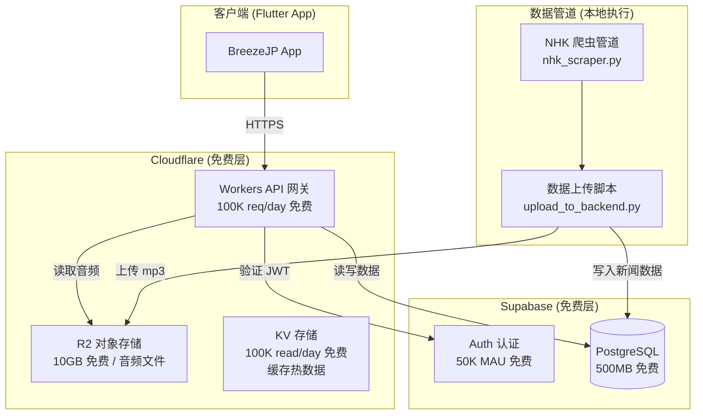
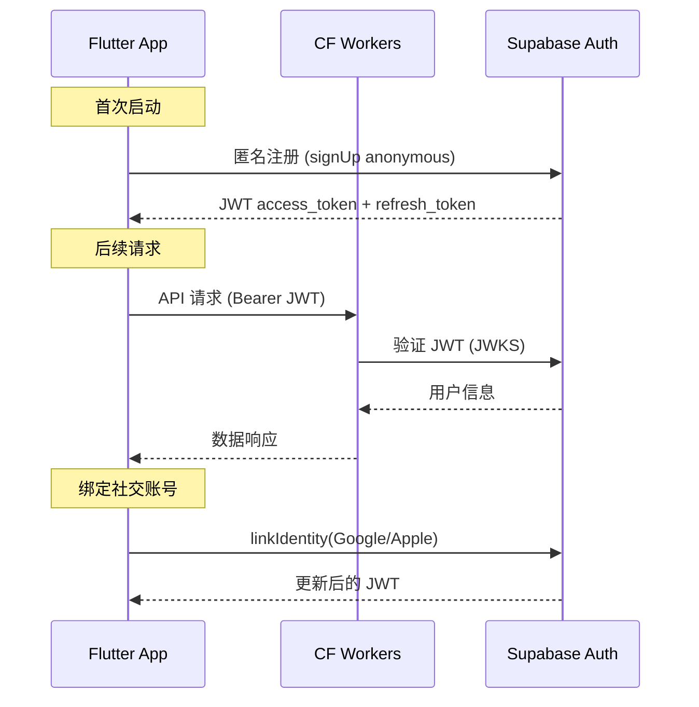
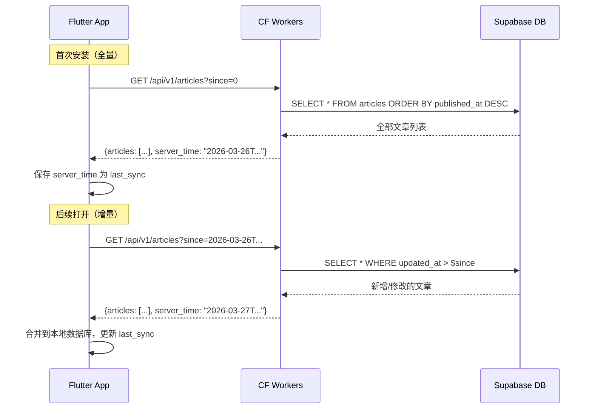

# BreezeJP 后端系统架构设计

为 BreezeJP 日语学习 App 设计最低成本的登录功能和 REST API，使用 Supabase（认证 + 数据库）和 Cloudflare Workers（API 网关 + 静态资源）。

---

## 一、整体架构概览



### 技术选型理由

| 组件 | 选择 | 理由 |
|------|------|------|
| 认证 | Supabase Auth | 免费 50K MAU，内置 JWT，无需自建 |
| 数据库 | Supabase PostgreSQL | 免费 500MB，SQL 查询灵活，支持 JSON 列 |
| API 网关 | Cloudflare Workers | 免费 100K req/day，边缘节点全球覆盖，冷启动 <5ms |
| 音频存储 | Cloudflare R2 | 免费 10GB 存储 + 无出流量费 |
| 热数据缓存 | Cloudflare KV | 免费 100K read/day，缓存新闻列表避免频繁查库 |

### 月成本估算

| 项目 | 免费额度 | 预估用量 | 月成本 |
|------|----------|----------|--------|
| Supabase Auth | 50K MAU | <1K | **$0** |
| Supabase DB | 500MB | ~50MB | **$0** |
| CF Workers | 100K req/day | ~2K req/day | **$0** |
| CF R2 | 10GB | ~2GB (音频) | **$0** |
| CF KV | 100K read/day | ~5K read/day | **$0** |
| **总计** | | | **$0/月** |

---

## 二、认证系统设计 (Supabase Auth)

### 2.1 支持的登录方式

| 登录方式 | 优先级 | Supabase 免费支持 |
|----------|--------|-------------------|
| 匿名登录 (Anonymous) | P0 | ✅ 内置 |
| Google 登录 | P1 | ✅ OAuth Provider |
| Apple 登录 | P1 | ✅ OAuth Provider（iOS 必须提供） |
| 邮箱密码 | P2 | ✅ 内置 |

> [!IMPORTANT]
> **推荐优先实现匿名登录 + Google/Apple**。匿名登录让用户零门槛使用 App，后续可绑定第三方账号升级为正式用户，用户数据无缝迁移。

### 2.2 认证流程



### 2.3 Flutter 客户端集成

使用 `supabase_flutter` 包，直接与 Supabase Auth 通信：

```dart
// 依赖: supabase_flutter: ^2.x
final supabase = Supabase.instance.client;

// 匿名登录
await supabase.auth.signInAnonymously();

// Google 登录
await supabase.auth.signInWithOAuth(OAuthProvider.google);

// 获取当前 JWT（自动刷新）
final jwt = supabase.auth.currentSession?.accessToken;
```

### 2.4 CF Workers JWT 验证

Workers 使用 Supabase JWKS 公钥验证 JWT，**不需要调用 Supabase API**，零延迟：

```javascript
// 从 Supabase 获取 JWKS 公钥（缓存在 KV）
const SUPABASE_JWT_SECRET = env.SUPABASE_JWT_SECRET;

async function verifyJWT(request, env) {
  const token = request.headers.get('Authorization')?.replace('Bearer ', '');
  // 使用 jose 库验证 JWT 签名
  const payload = await jwtVerify(token, secret);
  return payload.sub; // user_id
}
```

---

## 三、数据库设计 (Supabase PostgreSQL)

### 3.1 表结构

```sql
-- 新闻文章表（轻量索引信息）
CREATE TABLE articles (
    id TEXT PRIMARY KEY,              -- NHK 新闻 ID, e.g. "ne2026031311469"
    title TEXT NOT NULL,              -- 带 ruby 注音标题
    clean_title TEXT NOT NULL,        -- 纯净标题
    published_at TIMESTAMPTZ NOT NULL, -- 发布时间
    audio_url TEXT,                   -- R2 音频 URL
    duration_ms INTEGER DEFAULT 0,    -- 音频时长
    sentence_count INTEGER DEFAULT 0, -- 句子数量
    created_at TIMESTAMPTZ DEFAULT now(),
    updated_at TIMESTAMPTZ DEFAULT now()
);

-- 新闻详情表（完整句子+分词数据，JSONB 存储避免数百个关联表）
CREATE TABLE article_details (
    article_id TEXT PRIMARY KEY REFERENCES articles(id),
    items JSONB NOT NULL,             -- 句子数组（含 words 分词）
    created_at TIMESTAMPTZ DEFAULT now(),
    updated_at TIMESTAMPTZ DEFAULT now()
);

-- 同步版本号表（支持增量更新）
CREATE TABLE sync_metadata (
    key TEXT PRIMARY KEY,
    value TEXT NOT NULL,
    updated_at TIMESTAMPTZ DEFAULT now()
);

-- 索引
CREATE INDEX idx_articles_published_at ON articles(published_at DESC);
CREATE INDEX idx_articles_updated_at ON articles(updated_at DESC);
```

> [!TIP]
> **为什么 `items` 用 JSONB 而非关联表？**
> 每篇新闻约 5-10 句，每句 10-30 个分词 word，关联表会产生数千行。JSONB 单列存储读性能极高（一次查询即可获取完整文章数据），且 PostgreSQL 支持 JSONB 索引和部分查询。
> 按当前 [test_output.json](file:///Users/summer/work/money/breeze_jp/assets/mock/test_output.json) 数据量估算：~22 篇文章占 ~240KB，500MB 免费空间可存储 **~45,000 篇文章**，足够用 10+ 年。

### 3.2 增量同步机制

核心思路：**客户端记住上次同步时间戳，每次只拉取更新的数据**。



---

## 四、REST API 设计 (Cloudflare Workers)

### 4.1 端点设计

| 方法 | 路径 | 认证 | 描述 |
|------|------|------|------|
| `GET` | `/api/v1/articles` | ✅ | 获取新闻列表（支持增量） |
| `GET` | `/api/v1/articles/:id` | ✅ | 获取新闻详情（含分词） |
| `GET` | `/api/v1/audio/:id` | ✅ | 获取音频文件（代理 R2） |
| `GET` | `/api/v1/health` | ❌ | 健康检查 |

### 4.2 API 详细定义

#### `GET /api/v1/articles` — 获取新闻列表

**请求参数：**

| 参数 | 类型 | 必填 | 说明 |
|------|------|------|------|
| `since` | ISO8601 | 否 | 上次同步时间，不传则全量 |
| `limit` | int | 否 | 默认 50，最大 200 |
| `cursor` | string | 否 | 分页游标（文章 ID） |

**响应示例（全量 `since` 未传）：**

```json
{
  "data": [
    {
      "id": "ne2026031311469",
      "title": "イランのモジタバ師[し]...",
      "clean_title": "イランのモジタバ師...",
      "published_at": "2026-03-13T19:30:00+09:00",
      "audio_url": "/api/v1/audio/ne2026031311469",
      "duration_ms": 60660,
      "sentence_count": 6
    }
  ],
  "meta": {
    "total": 22,
    "has_more": false,
    "cursor": null,
    "server_time": "2026-03-26T21:16:51+08:00"
  }
}
```

**响应示例（增量 `since=2026-03-25T00:00:00Z`）：**

```json
{
  "data": [
    {
      "id": "ne2026032611999",
      "title": "今日の新しいニュース...",
      "clean_title": "今日の新しいニュース...",
      "published_at": "2026-03-26T10:00:00+09:00",
      "audio_url": "/api/v1/audio/ne2026032611999",
      "duration_ms": 45000,
      "sentence_count": 5
    }
  ],
  "meta": {
    "total": 1,
    "has_more": false,
    "cursor": null,
    "server_time": "2026-03-26T21:16:51+08:00"
  }
}
```

#### `GET /api/v1/articles/:id` — 获取新闻详情

**响应示例：**

```json
{
  "data": {
    "id": "ne2026031311469",
    "title": "イランのモジタバ師[し]...",
    "clean_title": "イランのモジタバ師...",
    "published_at": "2026-03-13T19:30:00+09:00",
    "audio_url": "/api/v1/audio/ne2026031311469",
    "duration_ms": 60660,
    "items": [
      {
        "text": "イランの新[あたら]しいトップ...",
        "translation": "伊朗新任领导人...",
        "start_ms": 900,
        "end_ms": 7740,
        "index": 0,
        "words": [
          {
            "surface_form": "イラン",
            "pos": "名詞",
            "reading": "イラン",
            "furigana": "",
            "ruby_text": "イラン"
          }
        ]
      }
    ]
  }
}
```

> [!NOTE]
> 详情 API 返回的 `words` 精简了部分冗余字段（如 `word_id`, `word_type`, `word_position` 等），减少传输体积约 40%。客户端不需要这些字段。

#### `GET /api/v1/audio/:id` — 获取音频

Workers 直接从 R2 读取并流式返回 mp3，设置 `Cache-Control: public, max-age=31536000`（音频不变，可永久缓存）。

### 4.3 缓存策略

```
                    ┌─────────────────────────┐
                    │  CF Edge Cache (自动)     │
                    │  TTL: 1h (列表)          │
                    │  TTL: 24h (详情)         │
                    │  TTL: 365d (音频)        │
                    └────────┬────────────────┘
                             │ MISS
                    ┌────────▼────────────────┐
                    │  CF KV (可选热缓存)       │
                    │  新闻列表 JSON 缓存       │
                    └────────┬────────────────┘
                             │ MISS
                    ┌────────▼────────────────┐
                    │  Supabase PostgreSQL     │
                    └─────────────────────────┘
```

- **列表 API**：Workers 先检查 KV 缓存（key: `articles_list`），缓存 TTL 1 小时
- **详情 API**：使用 CF Edge Cache，TTL 24 小时（新闻内容不变）
- **音频**：使用 CF Edge Cache，TTL 1 年（永不变）

### 4.4 错误响应格式

```json
{
  "error": {
    "code": "UNAUTHORIZED",
    "message": "Invalid or expired token"
  }
}
```

| HTTP 状态码 | code | 场景 |
|-------------|------|------|
| 401 | `UNAUTHORIZED` | JWT 无效或过期 |
| 404 | `NOT_FOUND` | 文章不存在 |
| 429 | `RATE_LIMITED` | 请求过频 |
| 500 | `INTERNAL_ERROR` | 服务器错误 |

---

## 五、数据管道改造

### 5.1 当前管道 → 新管道

```
[现有管道（不变）]
nhk_scraper.py → align.py → process_all_sudachi.py → translate_json.py
                                                            │
                                                            ▼
                                                     processed.json
                                                            │
                            ┌───────────────────────────────┤
                            │                               │
                    [现有] convert_to_mock.js        [新增] upload_to_backend.py
                            │                               │
                            ▼                               ▼
                    test_output.json              Supabase DB + R2
                    (本地 mock 保留)              (线上数据)
```

### 5.2 新增 `upload_to_backend.py`

脚本功能：
1. 扫描 `data/{id}/processed.json`，与 Supabase DB 比对，只上传新增/修改的
2. 上传 mp3 到 Cloudflare R2
3. 写入 `articles` + `article_details` 到 Supabase
4. 更新 `sync_metadata` 版本信息

```
位置: tools/nhk_data_pipeline/scripts/upload_to_backend.py
```

### 5.3 管道执行流程更新

```bash
# 原有流程（不变）
bash scripts/run_pipeline.sh --hdnts "<hdnts_token>"

# 新增：上传到后端（可选）
python scripts/upload_to_backend.py
```

---

## 六、Flutter 客户端集成方案

### 6.1 新增依赖

```yaml
# pubspec.yaml
dependencies:
  supabase_flutter: ^2.8.0    # Supabase 认证
  dio: ^5.4.0                  # HTTP 客户端（已有则复用）
```

### 6.2 新增文件结构

```
lib/
├── core/
│   ├── network/
│   │   ├── api_client.dart         # [NEW] Dio HTTP 客户端（带 JWT 拦截器）
│   │   └── api_endpoints.dart      # [NEW] API 端点常量
│   └── auth/
│       ├── auth_service.dart       # [NEW] Supabase Auth 封装
│       └── auth_state.dart         # [NEW] 认证状态管理
├── features/
│   └── nhk_news/
│       ├── data/
│       │   ├── nhk_remote_data_source.dart  # [NEW] 远程数据源
│       │   └── nhk_local_data_source.dart   # [MODIFY] 添加同步支持
│       └── domain/
│           └── nhk_sync_service.dart        # [NEW] 增量同步服务
```

### 6.3 同步策略（在客户端）

```dart
class NhkSyncService {
  /// 同步新闻数据
  /// 首次：全量拉取 → 存入本地 DB
  /// 后续：增量拉取 → 合并到本地 DB
  Future<void> sync() async {
    final lastSync = await getLastSyncTime(); // SharedPreferences
    final response = await api.getArticles(since: lastSync);
    
    // 合并到本地数据库
    for (final article in response.articles) {
      await localDb.upsertArticle(article);
    }
    
    // 更新同步时间戳
    await setLastSyncTime(response.serverTime);
  }
}
```

---

## 七、安全设计

| 威胁 | 对策 |
|------|------|
| JWT 伪造 | Workers 使用 Supabase JWKS 公钥验证签名 |
| API 滥用 | CF Workers 内置 Rate Limiting（免费层 10ms CPU/请求） |
| 数据泄露 | 所有 API 要求有效 JWT，Supabase RLS 行级安全 |
| 音频盗链 | R2 不对外公开，只能通过 Workers 代理访问 |
| CORS | Workers 只允许 App 的 User-Agent |

---

## 八、Cloudflare Workers 项目结构

```
backend/
├── wrangler.toml             # CF Workers 配置
├── package.json
├── src/
│   ├── index.ts              # 入口路由
│   ├── middleware/
│   │   ├── auth.ts           # JWT 验证中间件
│   │   └── cors.ts           # CORS 中间件
│   ├── routes/
│   │   ├── articles.ts       # 新闻列表/详情
│   │   └── audio.ts          # 音频代理
│   ├── services/
│   │   └── supabase.ts       # Supabase 客户端
│   └── types.ts              # 类型定义
└── tests/
```

---

## 九、你可能没有想到的 / 我帮你补全的

### 9.1 App 离线优先

App 应该**离线优先**：本地已有数据时直接展示，后台静默同步。网络不可用时不影响使用体验。当前 [test_output.json](file:///Users/summer/work/money/breeze_jp/assets/mock/test_output.json) 可作为内置初始数据。

### 9.2 音频按需下载

不要在同步新闻列表时一并下载所有音频。音频应该**按需下载**（用户点击某篇新闻时才下载），并缓存到本地。

### 9.3 数据压缩

`items` JSON 数据体积较大（单篇约 10KB），API 应启用 gzip/brotli 压缩。CF Workers 自动支持 brotli 响应压缩。

### 9.4 文章删除/下线同步

NHK 会定期下线旧新闻。需要支持软删除标记：
- `articles` 表增加 `is_archived BOOLEAN DEFAULT false`
- 增量同步时也返回被归档的文章 ID，客户端标记（但不删除本地数据，用户可能已收藏）

### 9.5 用户学习数据（未来扩展预留）

当前只做新闻 API，但认证系统建好后，未来可以扩展：
- 用户学习进度（哪些新闻已读、生词本）
- 跨设备同步
- 表结构预留 `user_id` 字段即可

### 9.6 API 版本控制

路径前缀 `/api/v1/` 预留版本控制，未来数据格式变更不影响老版本 App。

### 9.7 R2 音频文件命名

```
音频路径: audio/{article_id}.mp3
示例: audio/ne2026031311469.mp3
```

### 9.8 速率限制

免费 Workers 有 100K req/day 限制。按 1000 DAU 计算，每用户平均 100 请求/天，刚好用满。如果增长超出，Workers 付费版 $5/月 可获得 10M req/月。

---

## 十、实施阶段

### 阶段一：后端基建（预计 2 天）
1. 创建 Supabase 项目，建表
2. 创建 Cloudflare Workers 项目
3. 实现 JWT 验证中间件
4. 实现新闻列表/详情 API
5. 编写 `upload_to_backend.py` 数据上传脚本

### 阶段二：Flutter 客户端集成（预计 2-3 天）
1. 集成 `supabase_flutter`，实现匿名登录
2. 实现 API 客户端 + JWT 拦截器
3. 实现增量同步服务
4. 替换本地 mock 数据源为远程数据源
5. 添加离线缓存逻辑

### 阶段三：音频迁移（预计 1 天）
1. 上传现有 mp3 到 R2
2. 实现音频代理 API
3. Flutter 音频播放器对接新 URL

### 阶段四：登录 UI + 社交登录（预计 1-2 天）
1. 登录/注册 UI
2. Google/Apple OAuth 配置
3. 匿名用户绑定账号流程

---

## User Review Required

> [!IMPORTANT]
> 请确认以下关键决策：
> 1. **匿名登录优先** — 用户无需注册即可使用 App，后续绑定社交账号。你认同这个策略吗？
> 2. **words 分词数据精简** — API 返回时裁剪掉 `word_id`、`word_type`、`word_position`、`conjugated_type`、`conjugated_form`、`pos_detail_2`、`pos_detail_3`、`pronunciation` 等客户端不需要的字段。如果 App 有用到这些字段请告知。
> 3. **实施阶段** — 你希望从哪个阶段开始？是否有优先级调整？
> 4. **Supabase 项目** — 你是否已经创建了 Supabase 项目？需要 Supabase URL 和 anon key 来配置。
> 5. **Cloudflare Workers** — 你是否已经创建了 Cloudflare Workers 项目？还是需要从零开始？
> 6. **自定义域名** — 你是否有自定义域名用于 API？（CF Workers 免费版可用 `*.workers.dev` 子域名）

---

## Verification Plan

### 自动化测试
- Workers API：使用 `wrangler dev` 本地运行，用 `curl` 测试各端点
- 上传脚本：对比 `processed.json` 和数据库数据一致性

### 手动验证
1. 在 Supabase Dashboard 确认表结构和数据
2. 用 Postman/curl 调用 API 端点，验证 JWT 校验和数据返回
3. Flutter App 中验证：首次全量同步 → 新增数据后增量同步
4. 断网测试离线模式
